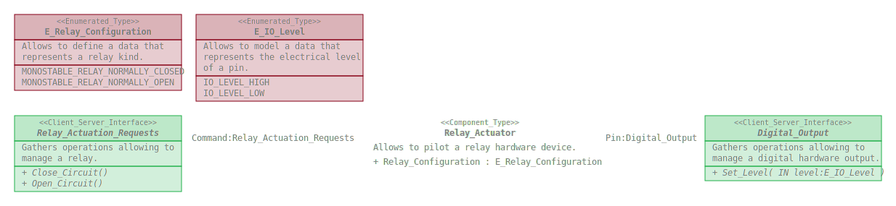

# Electrical_Relay

This repository defines a package gathering software elements allowing to manage
electrical relays.

## Content

The Electrical_Relay package gathers :
* Data_Type :
  * E_Relay_Configuration
* Interface :
  * Relay_Actuation_Requests
* Component_Type :
  * Relay_Actuator
  
## Overview

## Dependencies

* Hardware_IO_Interfaces : https://github.com/SanteyneEmbeddedSystems/Hardware_IO_Interfaces/releases/tag/v2.0.0

## Use

### With the Arduino IDE

This repository shall be clone within the _libraries_ folder of the _Arduino
sketchbook folder_.